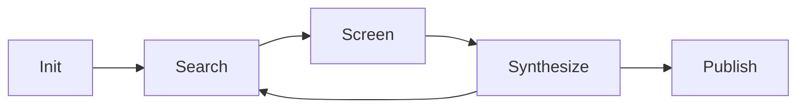

# The CoLRev documentation (demo) project explains how to use the CoLRev package

Comming soon (FAQ, Goals, Step-by-step procedure)

CoLRev helps researchers conduct transparent, reproducible, and collaborative literature reviews. It provides a structured workflow with version control and automation to support all stages of a review.

# The key goals of CoLRev:
- Enable end-to-end review management from initialization to publication.
- Support a modular review cycle: Search → Screen → Synthesize.
- Promote open science through Git-based tracking and reusable components.
- Reduce manual overhead with automation, integration, and configuration.

